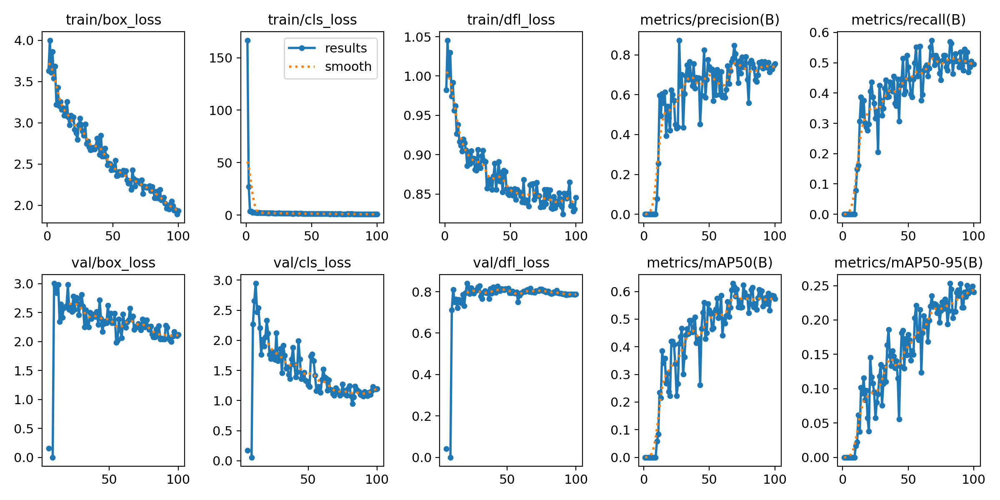
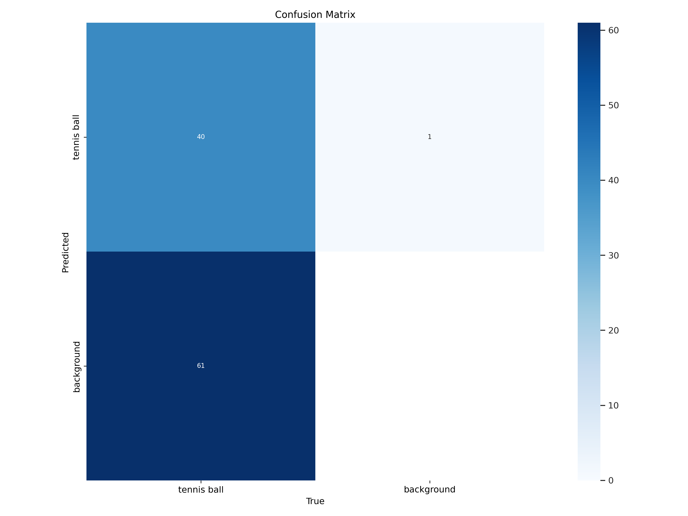
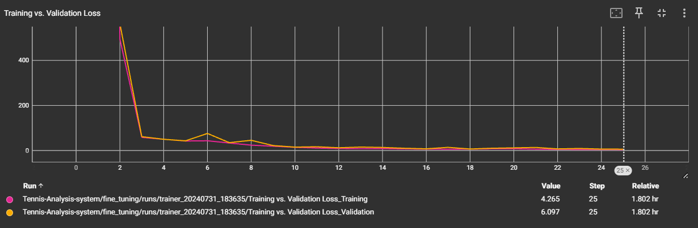

# Tennis-Analysis-System
---
Tennis-Analysis-System is a system that analyzes tennis matches and provides player statistics and mini court visualizations and It utilizes YOLO (You Only Look Once) v8x for player detection and tracking, and fine-tunes YOLOv5 for ball detection and tracking. Additionally, a ResNet50 model is used for keypoint detection and tracking.

## Usage
---
1. Clone the repository:
```shell
git clone https://github.com/Sh-31/Tennis-Analysis-System.git
```
2. Install the required dependencies:
```shell
pip3 install -r requirements.txt (linux)
pip  install -r requirements.txt (windows)
```
3. Run the main script:
```shell
python3 main.py (linux)
python main.py (windows)
```

## Sample Output
---
https://github.com/user-attachments/assets/b84af675-a264-4bbc-b265-40c2e8817670


## Datasets
---
#### Ball Detection
For ball detection, we used the tennis-ball-detection dataset from Roboflow. You can access it at the following link:
- [Tennis Ball Detection - Roboflow](https://universe.roboflow.com/viren-dhanwani/tennis-ball-detection)

#### Keypoint Detection
For keypoint detection, we used a dataset collected by yastrebksv. You can download it from the link below:
- [TennisCourtDetector - Google Drive](https://drive.google.com/file/d/1lhAaeQCmk2y440PmagA0KmIVBIysVMwu/view?usp=drive_link)

You can also download it using the code provided in the `Tennis-Analysis-system\fine_tuning\explore.ipynb` notebook.

## Results

---

### Fine-tuning YOLOv5 for Ball Detection

| Epoch | Train/Box Loss | Train/Cls Loss | Train/Dfl Loss | Precision (B) | Recall (B) | Val/Box Loss | Val/Cls Loss |
|-------|----------------|----------------|----------------|---------------|------------|--------------|--------------|
| 95    | 2.052          | 0.94742        | 0.86513        | 0.76142       | 0.53465    | 1.9983       | 1.1024       |
| 96    | 1.9937         | 0.90107        | 0.83483        | 0.71385       | 0.46934    | 2.0944       | 1.1647       |
| 97    | 1.9396         | 0.88057        | 0.83543        | 0.73493       | 0.48515    | 2.1743       | 1.233        |
| 98    | 1.9461         | 0.92784        | 0.82794        | 0.72858       | 0.50497    | 2.1229       | 1.2019       |
| 99    | 1.8929         | 0.82987        | 0.83066        | 0.74648       | 0.49505    | 2.0971       | 1.1892       |
| 100   | 1.933          | 0.88627        | 0.84558        | 0.75446       | 0.49505    | 2.1242       | 1.1936       |






### Fine-tuning ResNet50 for Keypoint Detection



## Features
---
- Player detection and tracking using YOLOv8
- Ball detection and tracking using YOLOv5 (fine-tuned)
- Keypoint detection and tracking using a Resnet50 model (fine-tuned)
- Mini court visualizations with player and ball positions
- Player statistics calculation

## Limitations
---
- Mini-court coordination is not generic (It needs the true height of the player to convert the proportion of meters to pixels). 
